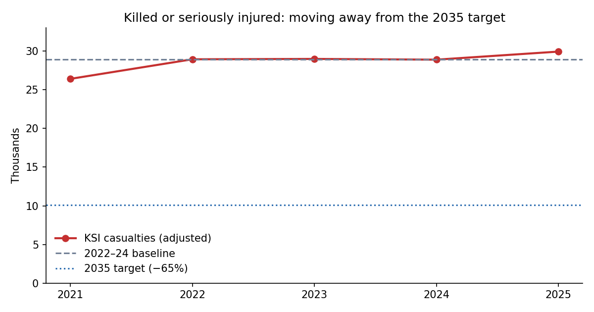
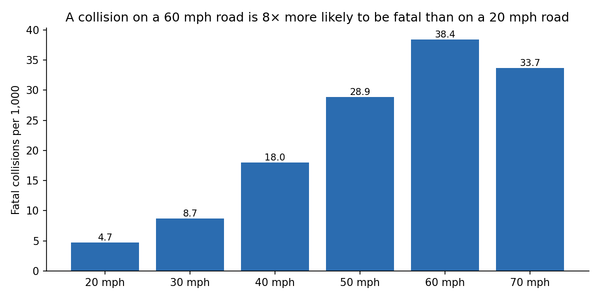
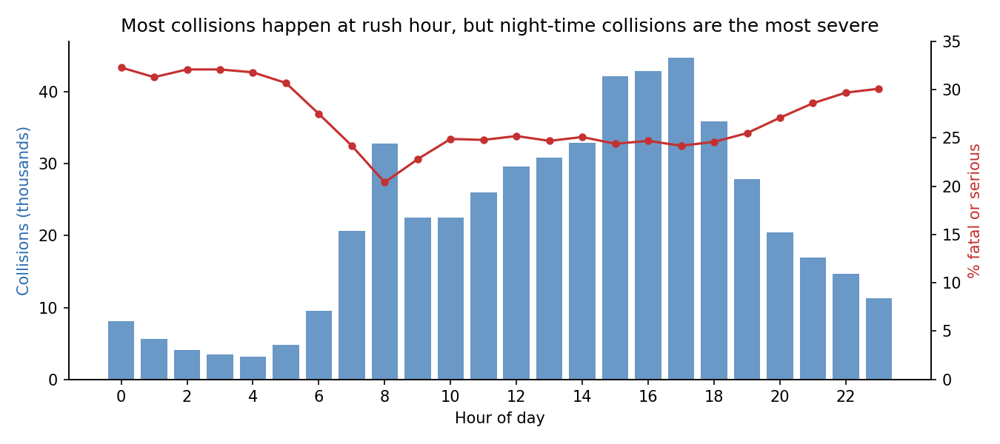
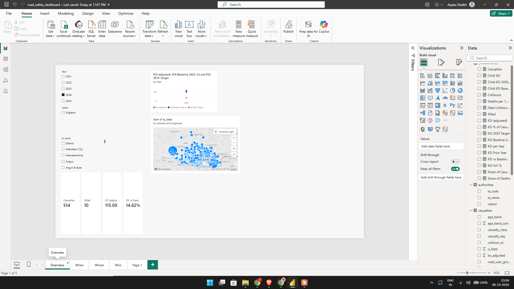
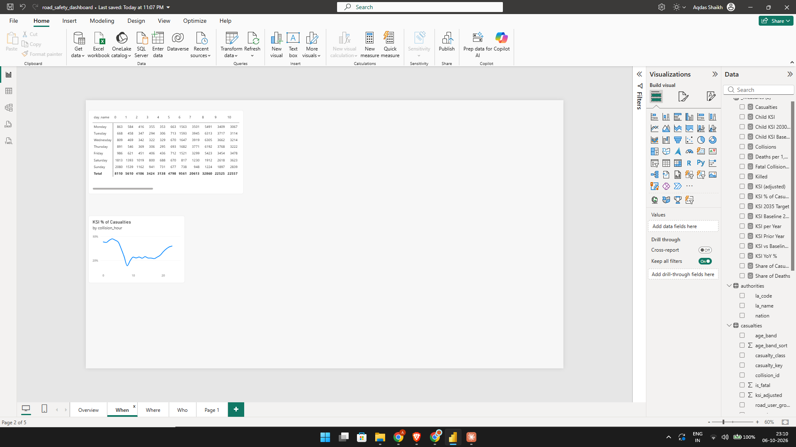
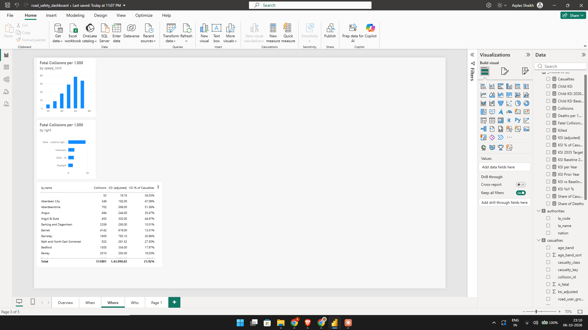
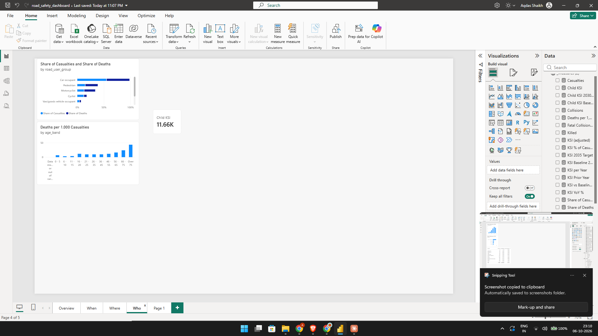

# Great Britain Road Safety Analysis (2021–2025)

This is an end-to-end analysis of **513,801 police-reported road collisions and 652,821 casualties** across Great Britain. It uses **Python** for data preparation, **PostgreSQL** for cleaning and analysis, and **Power BI** for an interactive dashboard. It asks whether Britain's roads are getting safer, and tracks progress against the government's January 2026 Road Safety Strategy targets.

The headline totals **match the Department for Transport's official statistics exactly** (see [Validation](#validation)).



## Key findings

- **Deaths are falling, but serious injuries aren't.** Fatalities fell to 1,538 in 2025, the lowest outside the pandemic years. But killed-or-seriously-injured (KSI) casualties rose to 29,918, **3.4% above the 2022–24 baseline**. Meeting the 2035 target (10,124) would need a **66% cut** from today's level.
- **Speed is the biggest driver of severity.** A collision on a 60 mph road is **8× more likely to be fatal** than one on a 20 mph road (38.4 vs 4.7 fatal per 1,000). Rural roads have 33% of collisions but **63% of deaths**.
- **Darkness without street lighting is 4× deadlier than daylight** (48.1 vs 12.1 fatal per 1,000 collisions).
- **Rush hour has the most collisions, but night has the most severe ones.** Collisions peak at 17:00. The share that are fatal or serious rises from 20% at 08:00 to **32% at midnight**.
- **Vulnerable road users carry a disproportionate share of deaths.** Motorcyclists make up 12% of casualties but 21% of deaths, and pedestrians 15% of casualties but 24% of deaths. Casualties aged over 75 are **4× more likely to die** than those aged 26–45.
- **E-scooter harm is growing fastest.** KSI among e-scooter riders rose **35%** between 2021 and 2025.
- **Child pedestrian injuries peak at 15:00 on weekdays,** about 50% higher than the morning school run. That's a clear target for after-school interventions.
- **Newcastle upon Tyne:** 86% of its collisions happen on roads of 30 mph or less (GB: 69%). Its share of collisions that are fatal or serious is lower than the national figure (21.2% vs 25.3%).




## Dashboard

A four-page Power BI dashboard (Overview, When, Where, Who), with slicers for year, nation and highway authority. The full dashboard is in [`powerbi/road_safety_dashboard.pdf`](powerbi/road_safety_dashboard.pdf).

<!--




-->

## Business questions

| # | Question | File |
|---|---|---|
| 1 | Are the roads getting safer, and for whom? | `sql/05_trends.sql` |
| 2 | When do collisions happen, and when are they worst? | `sql/06_when.sql` |
| 3 | Which roads and conditions make collisions deadlier? | `sql/07_where_conditions.sql` |
| 4 | Who is most at risk? | `sql/08_who.sql` |
| 5 | Is Britain on track for the 2035 and 2030 targets? | `sql/10_target_tracking.sql` |

## Pipeline

```
DfT CSVs + data guide ──► prepare_data.py ──► staging (raw TEXT) ──► clean tables ──► analysis SQL
                           (download, build     (\copy, 2.1M rows)    (typed, decoded,        │
                            lookups, validate)                          FK-linked)            ▼
                                                                                   Power BI views ──► dashboard
```

| Step | File | What it does |
|---|---|---|
| Prepare | `scripts/prepare_data.py` | Downloads data, turns DfT's Excel code list into a lookup table, validates columns |
| Schema | `sql/01_create_tables.sql` | Staging tables + typed tables with primary and foreign keys |
| Load | `sql/02_load_data.sql` | Bulk-loads 2.1M rows |
| Clean | `sql/03_clean_transform.sql` | Decodes 1,769 codes to labels, handles boundary changes, groups road users |
| Validate | `sql/04_data_quality_checks.sql` | Orphan records, internal consistency, missing values, unlabelled codes |
| Analyse | `sql/05`–`08`, `10` | Trends, time, conditions, road users, target tracking |
| Export | `sql/09_powerbi_export.sql` | Dashboard views + CSV export |
| Dashboard | `powerbi/` | DAX measures, theme, step-by-step build guide |

**Techniques:** a three-table relational model with foreign keys, a SQL function for decoding labels, CTEs, window functions (`LAG`, `RANK`, `SUM() OVER ()`, named `WINDOW`), `FILTER` aggregation, `GROUPING SETS`, `CROSS JOIN` for baselines, star-schema modelling, and DAX time intelligence (`SAMEPERIODLASTYEAR`, `CALCULATE` with `REMOVEFILTERS`).

## Design decisions

- **Adjusted severity, not reported severity.** Police forces switched to injury-based reporting at different times, which records more injuries as "serious". Raw serious counts rose 18% over the period, compared with 14% after adjustment. DfT's adjusted figures make years comparable, and they're what the official statistics use.
- **Current highway authority boundaries.** Councils were reorganised during the period (Cumbria, North Yorkshire and Somerset in 2023; Barnsley and Sheffield were recoded in 2025). Every collision is mapped to the authority responsible for that road *today*, so 5-year trends are consistent.
- **Rates, not just counts.** Busy 30 mph urban roads have the most collisions. "Fatal per 1,000 collisions" shows where a collision is most likely to be *deadly*.
- **The 2021 baseline is affected by COVID-19.** Traffic was lower in early 2021 because of lockdown, so progress is measured against the government's 2022–24 baseline instead.

## Data quality notes

- **A gap in DfT's own code list.** Casualty type code `33` appears 5,719 times but has no label in the 2025 data guide. 98.5% of these rows carry the e-scooter flag, so it's labelled as e-scooter / personal powered transporter. A generic unlabelled-codes check found this, and it was the only gap in the dataset.
- **Missing names.** DfT's highway authority lookup is missing six newer councils. These are filled from the district lookup, plus a documented manual patch.
- **Integrity checks.** There are zero orphan casualty or vehicle records, and the casualty counts on all 513,801 collisions match the casualty table exactly.
- **Missing location.** 53 collisions (0.01%) have no location. They're kept in totals and excluded from the map.

## Validation

The SQL results were reconciled against DfT's *Reported road casualties Great Britain, final results: 2025*:

| 2025 metric | This project | DfT official |
|---|---|---|
| Fatalities | 1,538 | 1,538 |
| KSI casualties (adjusted) | 29,918 | 29,918 |
| All casualties | 127,883 | 127,883 |
| Child KSI (under 16) | 2,432 | 2,432 |

## Limitations

- The data only includes collisions reported to the police, so injuries that aren't reported are missing. This is a known limitation of STATS19.
- Authority comparisons use collision-based rates rather than population or traffic volumes, so they show *severity* rather than *risk per person*. The natural next step is to add ONS population or DfT traffic data.
- Contributory factors (e.g. speeding, impairment) aren't in the public dataset.

## How to run

Requires **PostgreSQL 14+**, **Python 3.9+** and **Power BI Desktop** (Windows). The full step-by-step guide is in [`SETUP.md`](SETUP.md), and the dashboard guide is in [`powerbi/BUILD_GUIDE.md`](powerbi/BUILD_GUIDE.md).

```bash
pip install -r requirements.txt
python scripts/prepare_data.py
createdb -U postgres road_safety
psql -U postgres -d road_safety -f run_all.sql      # about 2-5 minutes
python scripts/make_charts.py
```

## Data source and licence

Source: Department for Transport, [Road Safety Data (STATS19)](https://www.gov.uk/government/statistics/road-safety-data). Contains public sector information licensed under the [Open Government Licence v3.0](https://www.nationalarchives.gov.uk/doc/open-government-licence/version/3/). The code in this repository is MIT licensed.
